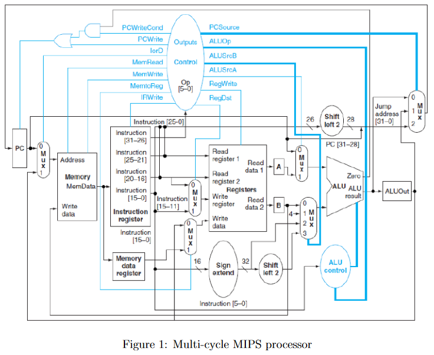

# MIPS-processor simulator
This serves as my implementation of the 2nd coursework for Informatics 2C - Computer Systems, taught by Dr. Grot at the University of Edinburgh

## instructions
The C program simulates the following instruction for a multi-cycle MIPS processor: 
* ADD
* LW
* SW
* ADDI
* J
* BQE
* SLT

## credit
Instructor: Boris Grot
TA: Siavash Katebzadeh
